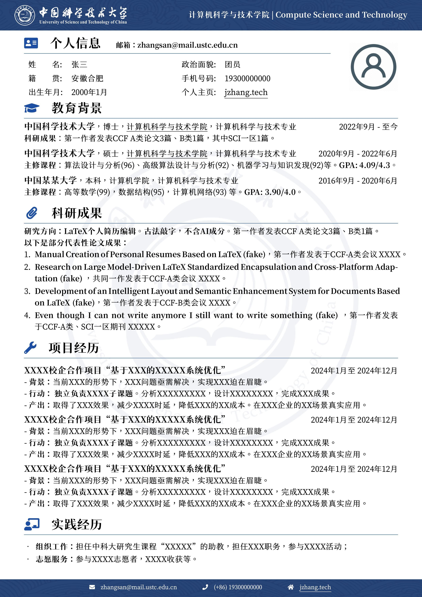

# USTC中国科学技术大学中文简历模板

此项目Github: https://github.com/JunyangZhangUSTC/LaTeX-CV-template-for-USTC

> 此项目修改自：https://github.com/yanboc/LaTeX-CV-template-for-Wuhan-University

## 使用方法
1. Main Document选择为`main.tex`。
2. 使用XeLaTeX编译。不成功的话可以试着多编译几次（之前的模板里这样说）。
2. 建议上传Overleaf编译。如果文件太大可以分几次上传。

## 效果

简历展示效果如下。

## 版权与字体
本模板使用的字体为开源字体狮尾四季春，详见
https://github.com/max32002/swei-spring

## 致谢
本模板基于
1. [北师大中文CV模板](https://github.com/LeyuDame/BNUCV)
2. [西北工业大学中文CV模板](https://www.overleaf.com/latex/templates/npu-cv/mncqzxhvfzrx)
3. [武汉大学中文CV模板](https://github.com/yanboc/LaTeX-CV-template-for-Wuhan-University)

这个武汉大学中文CV模板做得非常好，此模板只是在此基础上小修。

## 其他注意事项

所有以\fa开头的都是font awesome宏包里的logo。详细信息参考：[font awesome文档](https://mirrors.ibiblio.org/CTAN/fonts/fontawesome5/doc/fontawesome5.pdf)

